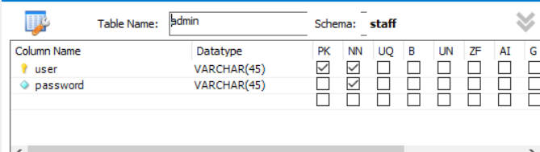
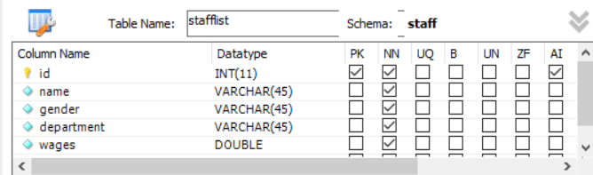
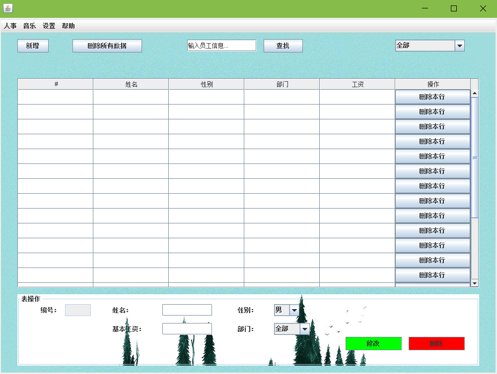

# StaffManage

**StaffManage是面向HR的员工管理器

使用mysql作为数据库，第三方库JLayer用来播放背景音乐

eclipse的插件windowbuilder编写UI

其中mysql用户名为root,密码为空，所连接的是本地数据库（127.0.0.1）

数据库名为staff,登陆界面账户密码储存在表admin中

Translate:

StaffManage is employee manager for HR

Using mysql as a database, third-party library JLayer to play background music

Eclipse plug-in windowbuilder write UI

The mysql user name is root, the password is empty, and the connected database is local database (127.0.0.1)

The database is named staff, login interface account password is stored in the table admin

表 admin:

表 stafflist:

以下为运行效果：

